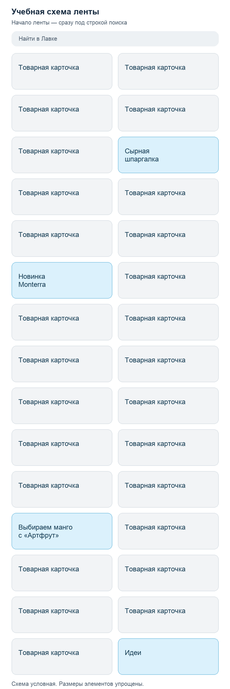
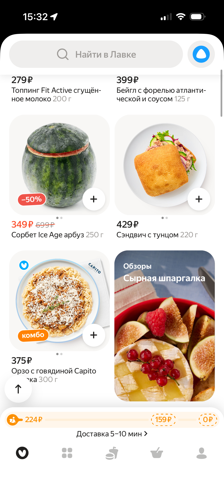

# Сколько пользователей увидят рекламу в Яндекс Лавке?

## Бизнес-контекст

В приложении Яндекс Лавки можно размещать рекламу: например, баннеры среди товарных карточек в ленте или на экране поиска. У этих мест разная аудитория: пользователи по-разному перемещаются по приложению и просматривают ленту на разную глубину.

Рекламная команда планирует продажи размещений до конца года. Чтобы предлагать их рекламодателям, ей нужно понимать, какой охват потенциально может обеспечить каждое место.

## Вопрос к аналитику

**Какой среднедневной охват может обеспечить каждое из выбранных рекламных мест в каждом месяце до конца года, если реклама доступна для показа всем пользователям без ограничений таргетинга?**

Под охватом понимается число уникальных пользователей, которые увидят баннер. Подготовьте оценку среднего дневного охвата отдельно для октября, ноября и декабря 2026 года. Рекламные места, для которых необходимо расчитать охват: первые 4 баннера в ленте товаров и большой баннер на странице поиска. 

## Что есть в вашем распоряжении

На скриншотах показаны рекламные места, которые нужно оценить. Четыре из них встроены в ленту и по форме напоминают товарные карточки: сейчас там размещены «Сырная шпаргалка», Monterra, «Выбираем манго с „Артфрут“» и «Идеи». Пятое — баннер Циан на экране поиска.

Ваша оценка должна относиться к самому месту размещения, независимо от того, какой бренд или продукт там рекламируется. Команда хочет оценить всю потенциально доступную аудиторию.

Скриншоты иллюстрируют внешний вид размещений. Расположение мест фиксировано для всех пользователей. В рамках кейса баннер в поиске появляется на первом экране при открытии этого раздела.

### Схема ленты

### Примеры размещений в приложении

| «Сырная шпаргалка» | Monterra |
|---|---|
|  |  |

| «Выбираем манго с „Артфрут“» | «Идеи» |
|---|---|
|  |  |

**Баннер в поиске**

Для исследования вам предоставлены три таблицы:

| Таблица | Содержание |
|---|---|
| `dau_forecast.csv` | Средний DAU по месяцам: план на весь 2026 год и факт за январь–август. С сентября факт отсутствует. План октября–декабря — предоставленный командой прогноз активности для расчётов. |
| `navigation_events.csv` | Открытия приложения и посещения ленты, поиска и каталога за 1–28 сентября. Для каждого события указаны пользователь, время и тип события. |
| `product_impressions.csv` | Показы товарных карточек за 1–28 сентября с указанием пользователя, времени, раздела и позиции. Просмотр означает появление карточки на экране и не требует нажатия. |

Все данные синтетические. Событий показа или нажатия на баннеры в таблицах нет.

## Ожидаемый результат

Подготовьте исследование в Jupyter Notebook. Оно должно позволять проследить весь путь от запроса команды до вашего ответа:

- **Бизнес-контекст:** для какого решения нужна аналитика
- **Исследовательский вопрос:** что именно вы оцениваете
- **Методология:** как вы предлагаете ответить на вопрос с помощью доступных данных
- **Подготовка данных и расчёты:** реализация вашего подхода с помощью pandas
- **Вывод:** ответ команде, подкреплённый результатами расчётов
- **Ограничения:** что нужно учитывать при использовании вашей оценки.

Используйте [ноутбук-шаблон](research_template.ipynb). Добавляйте текстовые и кодовые ячейки по мере необходимости. Перед сдачей проверьте, что ячейки выполняются по порядку и воспроизводят результаты исследования.

## Как будем работать

**На семинаре** вы познакомитесь с кейсом и данными, уточните запрос и предложите методологию в группах. Затем мы обсудим подходы и на их основе сформируем план исследования. В оставшееся время можно будет начать работу с данными.

**Дома** вы завершите расчёты и оформите исследование в ноутбуке.
